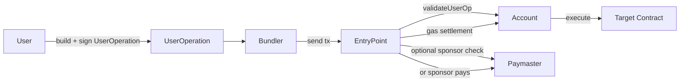

ERC-4337 是什么，以及它如何实现 Account Abstraction。

<!-- more -->

# 什么是 Account Abstraction

`Account Abstraction` 可以直译为“账户抽象”。如果简单理解，它想做的事情就是：**把账户原本一些固定的规则，变成可以自定义的逻辑。**

在传统的以太坊模型中，普通用户使用的大多是 EOA（Externally Owned Account，外部拥有账户）。它的特点很直接：谁持有私钥，谁就可以发起交易，也就可以控制这个账户。

而 `Account Abstraction` 想改变的，正是这种相对固定的账户模型。它希望账户不再只是一个“持有私钥就能直接操作”的地址，而是变成一个可以定义自身规则的账户。比如，什么样的签名才算有效，账户是否支持限额控制、权限管理，或者是否具备账户恢复等能力。

从这个角度看，AA 的核心并不只是增加几个功能，而是让“账户如何被控制、如何验证、如何执行”这件事，变得更加灵活和可编程。

# ERC-4337 是如何在不修改共识层的前提下实现 AA 的

如果想让以太坊原生支持更灵活的账户模型，最直接的办法就是修改以太坊协议本身，让整个区块链直接理解新的账户类型和新的交易验证方式。但这样做需要改动共识层，实现和推广的成本都很高。

而 ERC-4337 的做法是：**不去修改以太坊本身，而是在现有体系之上额外构建一层新的用户操作流程。**

在 ERC-4337 中，用户提交的不再是传统的交易，而是一种叫做 `UserOperation` 的数据结构。它不会直接作为链上交易被打包进区块中，而是先交给 `Bundler` 收集和处理，再由 Bundler 发起一笔普通交易，统一调用 `EntryPoint` 合约。

随后，`EntryPoint` 会进一步调用用户的智能账户合约，完成验证、执行和 Gas 结算等逻辑。这样一来，以太坊链本身看到的仍然是一笔普通交易，但在这笔普通交易背后，账户模型已经变得更加灵活了。

所以 ERC-4337 的关键点就在于：**它并不是通过修改共识层来实现账户抽象，而是通过链上合约和链下基础设施的配合，在现有以太坊基础之上实现了 AA。**

# ERC-4337 的几个核心角色

## Account

`Account` 就是用户使用的智能合约账户，也可以理解为 AA 钱包本体。

在传统模型中，用户使用的是一个 EOA 地址；但是在 ERC-4337 中，用户通常控制的是一个带有自定义逻辑的合约账户。这个账户负责定义自身规则，例如如何验证签名，是否支持权限控制等。

从职责上来看，`Account` 最核心的事情基本只有两件：

1. 验证这笔 `UserOperation` 是否合法
2. 验证成功之后，执行其中的调用逻辑

## UserOperation

`UserOperation` 是 ERC-4337 中定义的一个数据结构，包含了用户操作请求。

它比较类似传统交易，里面同样描述调用目标、Gas 参数、签名信息等。但是它本身不会直接作为链上交易进入区块，更像是一份“我要让我的智能合约账户做什么”的指令，然后交给后续的基础设施去处理。

所以从定位来说，`UserOperation` 是用户表达操作意图的数据结构，而不是最终上链的交易本身。

## Bundler

`Bundler` 是一种基础设施，它通常表现为一个链下服务。

它负责接收用户提交的 `UserOperation`，对其进行收集、检查和打包，然后再由 Bundler 发起一笔普通的链上交易，调用 `EntryPoint` 合约，从而完成 `UserOperation` 的执行。

也就是说，用户并不直接把交易发到链上，而是先把 `UserOperation` 交给 Bundler，再由 Bundler 发起一笔普通交易，统一调用 `EntryPoint` 合约。

在 ERC-4337 里，Bundler 更像是操作转发者和打包者。从工程实践上看，它通常是一个独立服务；但从原理上说，它更像是一种角色——只要有人愿意负责收集并提交 `UserOperation`，这个角色就成立，甚至用户自己也可以发起调用 `EntryPoint` 的交易。

## EntryPoint

`EntryPoint` 是 ERC-4337 体系中的统一入口合约。

它是 ERC-4337 的核心组成部分。Bundler 最终发起的普通交易，调用的就是 `EntryPoint` 合约；而 `EntryPoint` 的职责，就是按照 4337 的规则去处理一批 `UserOperation`，调用账户完成验证，调用账户执行操作，并处理 Gas 结算以及 `Paymaster` 相关逻辑。

它基本上就是 ERC-4337 在链上的总入口和调度中心。很多 4337 的相关流程都会围绕 `EntryPoint` 合约展开，因此它是整个机制中最核心的合约之一。

## Paymaster

`Paymaster` 是一个可选合约，它的作用是为用户代付 Gas。

在传统交易中，通常只能由发起交易的账户自己支付 Gas；但是在 4337 中，如果某个 `Paymaster` 愿意赞助，那么它就可以替用户承担这笔操作的 Gas 成本。

当然，`Paymaster` 并不是无条件付费的。在合约内部通常会设置校验逻辑，例如只赞助某些操作、某些地址，或者某些特定合约交互等。

所以总体而言，`Paymaster` 是一个按照预定规则决定是否赞助用户操作的合约。

## Factory

`Factory` 也是一个可选角色，主要用来部署智能账户。

在 ERC-4337 中，一个比较常见的设计是：即使用户的 `Account` 还没有真正部署到链上，也可以先构造一笔 `UserOperation`。这时候就可以通过 `Factory` 合约配合 `initCode`，在执行的过程中顺便把账户部署出来。

所以 `Factory` 的主要作用，就是让“账户未部署先使用”成为可能。

# 一笔 ERC-4337 操作是怎么完成的

如果把流程简化来看， 一笔 ERC-4337 操作就是这样:

1. 用户构造一个 `UserOperation`
2. 如果Account 合约还没有部署，那么就在其中包含 `initCode`
3. 用户对这笔交易进行签名
4. Bundler 接收到这一个 UserOperation
5. Bundler 发起一笔普通交易，调用EntryPoint 合约
6. EntryPoint 验证账户和相关参数是否合法
7. 验证通过之后，由账户合约执行真正的调用逻辑
8. 最后完成 Gas 结算

## 1. 用户构造一个 `UserOperation`

在传统交易中， 用户构造的是一笔普通交易， 而在 ERC-4337 中， 用户构造的是一个 `UserOperation`。

这个 UserOperation 是希望账户合约执行的什么操作， 以及这笔操作应该如何被验证和结算。

所以简单理解 UserOperation 就是用户向 4337 系统提交的一个操作请求。

## 2. 如果账户还没部署，可以顺便部署

在 ERC-4337 中，即使账户还没有真正的部署到链上， 也可以先发起操作。

这时候在 UserOperation 里面带上部署账户的 initCode， 这样在执行的过程中，系统会先将账户合约部署出来，然后再继续后面的验证以及执行流程。

## 3. 用户对这笔操作进行签名

在 ERC-4337 中， 仍然是需要用户授权这笔操作这件事情并没有消失， 区别在于，传统交易通常是由 EOA 私钥直接对交易签名，而在 ERC-4337 中， 签名的对象通常变成了 UserOperation 对应的哈希。 随后在由账户合约自己验证逻辑去决定这个签名是否有效。

## 4. Bundler 接收并打包 UserOperation

用户构造并签名 UserOperation 后， 并不会直接把它当作交易发送到链上， 而是先发送给 Bundler。

Bundler 是一个链下入口， 它提供了一个 RPC 来接受请求， 收集 UserOperation， 并在合适的时候将一个或者多个 UserOperation 打包起来。

## 5. Bundler 发起普通交易，调用 EntryPoint

接下来，`Bundler` 会自己发起一笔普通的链上交易，目标通常是 `EntryPoint` 合约的相关方法，例如 `handleOps`。

## 6. EntryPoint 负责统一验证和调度

当 `EntryPoint` 收到这笔调用之后，它会按照 ERC-4337 的规则去处理这些 `UserOperation`。

这里通常包括几件事情：

- 检查这笔操作的基本参数
- 调用账户去验证签名和 nonce
- 如果有 `Paymaster`，还要检查是否允许代付
- 为后续执行和结算做好准备

所以可以把 `EntryPoint` 看作整个 4337 流程在链上的统一入口和调度中心。

## 7. Account 执行真正的调用逻辑

当验证都通过之后，真正执行操作的仍然是用户自己的 `Account` 合约。
比如用户想调用某个业务合约的方法，那么通常不是由 `EntryPoint` 直接帮他调用业务合约，而是由 `Account` 根据
`UserOperation` 中的内容，去执行真正的外部调用。

## 8. 最后完成 Gas 结算

执行结束后，还需要完成这笔操作的 Gas 结算。

如果没有 `Paymaster`，那么通常由账户自己承担相关成本；如果有 `Paymaster` 并且它愿意赞助，那么 Gas 就可以由
`Paymaster` 来支付。

# UserOperation 里最重要的几个字段

## sender

`sender` 表示这笔操作对应的账户地址，也就是这笔 `UserOperation` 想要驱动的那个智能账户。

在 ERC-4337 中，真正完成验证和执行的，是 `sender` 对应的 `Account` 合约。因此，`sender` 表示的并不是一个普通的交易发送者，而是这笔操作所属的账户。

## nonce

`nonce` 用来防止同一笔操作被重复执行，也就是防止重放攻击。

这一点和传统交易里的 nonce 类似，但在 ERC-4337 中，它通常由账户和 `EntryPoint` 体系共同校验。它表示这笔操作在当前账户下的执行序号。

## initCode

`initCode` 用来解决“账户还没有部署时，如何发起第一笔操作”这个问题。

如果 `sender` 对应的账户还不存在，就可以在 `UserOperation` 中带上 `initCode`。这样在执行过程中，系统会先根据这段数据把账户部署出来，然后再继续后面的验证和执行流程。

因此，`initCode` 的作用就是让账户在未部署时也能先被使用。

## callData

`callData` 表示这笔操作最终要执行什么。

在 ERC-4337 中，这里的 `callData` 通常不是直接发给某个业务合约，而是先发给用户自己的 `Account` 合约，再由 `Account` 去执行真正的外部调用。

因此，`callData` 更准确地说，是账户应当如何执行这笔操作的描述。

## signature

`signature` 是用户对这笔 `UserOperation` 的授权证明。

在传统交易中，通常是 EOA 私钥直接对交易签名；而在 ERC-4337 中，通常是对 `UserOperation` 对应的哈希进行签名，再由账户在验证阶段判断这个签名是否有效。

因此，`signature` 的重点并不在于必须采用哪一种固定算法，而在于账户能够据此确认：这笔操作确实得到了合法授权。

## Gas 相关字段

`UserOperation` 中还有一组重要字段与 Gas 有关，例如：

- `verificationGasLimit`
- `callGasLimit`
- `preVerificationGas`
- `maxPriorityFeePerGas`
- `maxFeePerGas`

这些字段大致可以分成两类。

第一类描述这笔操作大概会消耗多少 Gas：

- `verificationGasLimit`：验证阶段最多可使用的 Gas
- `callGasLimit`：执行调用阶段最多可使用的 Gas
- `preVerificationGas`：打包、传输和基础处理所需的 Gas

第二类描述愿意按什么价格支付 Gas：

- `maxPriorityFeePerGas`
- `maxFeePerGas`

因此，Gas 相关字段表达的不只是“要执行什么”，也包括“愿意为这笔执行支付怎样的成本”。

## Paymaster 相关字段

如果这笔操作希望由 `Paymaster` 代付 Gas，那么 `UserOperation` 中还会包含与 `Paymaster` 相关的字段。

这部分字段主要表达两层含义：

- 希望由哪个 `Paymaster` 提供赞助
- 提供哪些数据，供 `Paymaster` 判断是否愿意代付

因此，`Paymaster` 相关字段本质上是在描述：这笔操作希望获得 Gas 赞助，以及赞助方据此进行校验所需要的信息。
